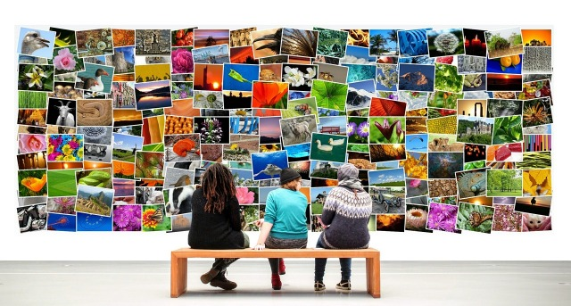
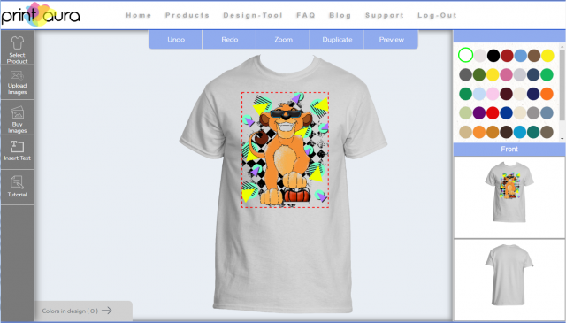

#### New Collections
Images convey thoughts, emotions, and ideas without the need for words. Whether you're an artist hoping to profit from your own creative ideas, a business owner with the desire to market your brand, or even just someone with a fun idea, Printaura can help you turn ideas into physical products.

***

#### Powered By Shutterstock    
We're thrilled to announce an API integration with Shutterstock a leading global provider of high-quality licensed photographs, vectors, illustrations, videos and music to businesses, marketing agencies and media organizations around the world. Working with its growing community of over 900,000 contributors, Shutterstock adds hundreds of thousands of images each week, and currently has more than 280 million images and more than 15 million video clips available.
    
We at Printaura have determined that one of the key, yet limiting, factors in launching successful merchandise campaigns is access to high quality licensed images. Printaura, in collaboration with Shutterstock, allows you to gain dynamic looking images created by talented professional creators with the correct license and prices that will make custom merchandise design easy, reduce overhead and increase your profits. You will have a treasure trove of images that can be used with a simple click of your mouse to create individual items or merchandise campaigns.

#### Get The Images You Want

At Printaura we believe our competitive advantage to you in growing your business lies in helping you to vertically integrate all the complex factors that make up this market segment. We have supported you with simple and easy to integrate platforms, we have provided you with quality printing, we deliver your product to your customer in 2-4 days. Now we can hand you the ultimate tool to use, high quality, copyright free images, at your fingertips...immediately...at unbelievable cost to you.

#### Create Something Fresh

We know that apparel is an important part of growing your brand or business and the funding source of many organizations and special interests. We want to be your partner in furthering your vision.
    
Start an online merchandise shop with your brand right now! [Sign Up](https://printaura.com/register/)

