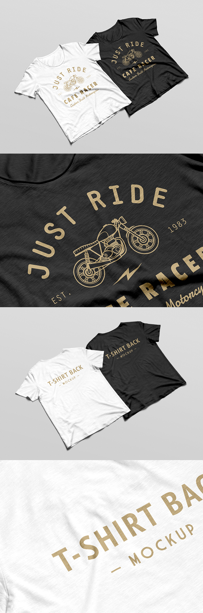

    
#### Use Mockups To Elevate Your Product Pages
## 
Setting up stunning and attention grabbing product pages can be tough if you aren’t a skilled product photographer, or don’t have the funds to hire one to start off. While we do have a free mockup generator, we understand if you desire something a little different. If you are looking to create a specific aesthetic that is more in line with your brand, online mockups can really help to elevate the look of your products and your designs! 

### 
21 Amazing Free T-shirt Mockups
 
## 
We poured through some of our favorite online graphic resource websites to find you guys some of the best t-shirt mockups that won’t cost you a dime!

    
### 1. Basic Unisex Flat Lay ###

##### [View Mockup](https://www.pixeden.com/psd-mock-up-templates/psd-tshirt-mockup-template-vol3)  

### 2. Women's Sweater Model

##### [View Mockup](https://www.pixeden.com/psd-mock-up-templates/psd-woman-long-sleeve-t-shirt-mockup)

### 3. Women's Scoop Neck Tee Flat Lay

##### [View Mockup](https://graphicburger.com/woman-t-shirt-mockup-psd-2/)

### 4. Women's V-Neck Flat Lay

##### [View Mockup](https://www.pixeden.com/psd-mock-up-templates/woman-psd-marl-t-shirt-mockup-vol2)

### 5. Tank Top Flat Lay

##### [View Mockup](https://graphicburger.com/tank-top-psd-mockup/)

### 6. Folded Flay Lay

##### [View Mockup](https://www.pixeden.com/psd-mock-up-templates/folded-psd-sweatshirt-mockup)

### 7. Men's Hanging Tees

##### [View Mockup](https://graphicburger.com/t-shirt-mockup-psd-2/)

### 8. Men's Lifestyle Model

##### [View Mockup](https://graphicburger.com/mens-t-shirt-mockup/) 

### 9.Long Sleeve Tee Flat Lay

##### [View Mockup](https://graphicburger.com/long-sleeve-t-shirt-mockup-psd/)

### 10. Kid's Tee Flat Lay

##### [View Mockup](https://www.pixeden.com/psd-mock-up-templates/baby-t-shirt-psd-mockup)

### 11.Men's Model

##### [View Mockup](https://www.designertale.com/round-neck-men-t-shirt-mock-up-233/)

### 12.Women's Flat Lay

##### [View Mockup](https://graphicburger.com/t-shirt-mockup-psd-4/)

### 13. Men's Model

##### [View Mockup](https://www.graphicsfuel.com/2016/10/free-tshirt-mockup-psd/)

### 14.Unisex Flat Lay

##### [View Mockup](https://graphicburger.com/t-shirt-mockup-psd-3/) 

### 15. Men's Hanging Mockup

##### [View Mockup](https://www.pixeden.com/psd-mock-up-templates/classic-psd-t-shirt-mockup-vol1)

### 16. Mockup Set - Men's and Women's

##### [View Mockup](https://freedesignresources.net/ultimate-apparel-mockup-free-demo/)

### 17. Women's Lifestyle Hoodie 

##### [View Mockup](https://freedesignresources.net/free-hoodie-psd-mockup-bundle/)

### 18. Basic Hoodie Mockup

##### [View Mockup](https://graphicburger.com/hoodie-mockup-psd-2/)

### 19. Women's Hanging Scoop Neck 

##### [View Mockup](https://graphicburger.com/woman-t-shirt-mockup-psd/)

### 20. Zipup Hoodie Flat Lay

##### [View Mockup](https://graphicburger.com/hoodie-mockup-psd/)

### 21. Hanging Sweaters

##### [View Mockup](https://graphicburger.com/jumper-mockup-psd/) 

### BONUS!
Tote Bag Mockup

##### [View Mockup](https://graphicburger.com/canvas-tote-bag-mockup/)

## Let Us Know!
## 
Did you end up loving or using any of these mockups? Let us know in the comments down below. If you have a favorite mockup, please feel free to share it with your fellow artists and entrepreneurs! 

