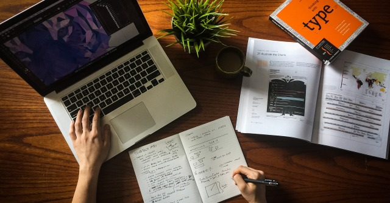

#### Are You Preparing Your Artwork Correctly For Print?

Before you upload your photos and begin to add them to products, please consider our image requirements first. This is your absolute best shot in guaranteeing that your prints will come out just the way you want them! If you ignore the image requirements, there is no telling how your art will be printed, because it has not been formatted to our printers or the specific products. So, before you upload, check out the **[Image Requirements](https://printaura.com/image-requirements/)** for the products you are interested in, adjust your designs accordingly, then upload! 

### 6 Common Artwork Preparation Mistakes

We've put together some of the most common mistakes we see in the artwork files that are sent in to us. If you're making these mistake, you certainly aren't alone. We hope this article will help you all if you are feeling confused, or aren't getting the results you expect from your prints. 

## 1. Using the wrong file type

Using the wrong file type can create a few different issues.

**Accepted File Types**

We accept the following file types:
<ul>
 	<li>.PSD</li>
 	<li>.PDF</li>
 	<li>.PNG</li>
</ul>
&nbsp;
Some products require specific file types, so make sure you check before you upload! If you submit a file using a file type we do not accept, it is very likely image quality issues will arise.

**Risks Associated With Using .PNG Files**

We do accept .PNG files, but they cannot be saved in a CMYK color profile. A .PNG file type is meant for web use, so it's only saveable in an RGB color profile. If the product you have chosen requires a CMYK profile, there may be some color shifting when the image is converted for printing. You can read more about how this is problematic below in the color profile section.

So why do we accept .PNG files? This is a way for people who do not have Photoshop or Illustrator to upload images that contain transparency. Check out our article, [The Problem With .PNGs And Printing](/blog/art-resources/the-problem-with-pngs-and-printing)

You can also check out our article, [File Type Cheat Sheet](/blog/art-resources/file-type-cheat-sheet), if you're interested in learning more about the different kinds of file types!

## 2. Using The Wrong Color Profile

Each of our products requires a specific color profile. The vast majority of your images will need to be submitted in a CMYK color profile, but there are some exceptions. Make sure to check the image requirements for each individual product.

**Check out this video tutorial on how to check and change your color profile.**

[plugin:youtube](https://www.youtube.com/embed/UUEMU4wFOfY)

**You can also check out this video explaining and demonstrating the difference between CMYK and RGB.**

[plugin:youtube](https://www.youtube.com/embed/qyOkoVUPB9g)

**If you'd like even more information on color profiles, take a look at our article, [The Difference Between RGB and CMYK](/blog/art-resources/the-difference-between-rgb-and-cmyk)**

## 3. Sizing Incorrectly

This is a big one! It is hard to visualize the size of your design on a computer screen, so it's no surprise that it is common for people to submit designs that are incorrectly sized for one reason or another. 

**File Size** 
    
First and foremost, it is important to understand that we print your image on whatever product you have chosen, in the size of the image file you submit itself. So if you submit a file that is 5 inches x 5 inches, it will be printed at 5 inches x 5 inches. Our mockup tool does not resize images for you. The mockup tool is simply a tool for us to understand where you want your images placed. Take a look at the image requirements for the specific product you'd like to add your design to, and make sure the file itself is in accordance with the size listed.

For products like our t-shirts, we have a size maximum. This means your image can be that size, or smaller. But again, your image will printed at the size of the file you have uploaded.

**If you aren't sure how large you should make your design, check out this video guide that can help you decide!**

[plugin:youtube](https://www.youtube.com/embed/JI6Fj4siSsE)

**You can also check out our article, [Design Sizing and Placement Guide](/blog/art-resources/design-sizing-and-placement-guide), for more information.**

**Cropping**

Cropping your design is very important! Since we print your images based on the file size you submit, the entirety of the file you submit is printed. So if you upload a file that is 5 inches by 5 inches, but the design only takes up 2 inches by 2 inches of that file, it will be printed at 2 inches by inches. If you want your image to take up the entirety of your workspace, make sure it fills the entire work space.

For more information on image sizing, check out our article, [How to Size Your Artwork Correctly For Print](/blog/art-resources/design-sizing-and-placement-guide)

## 4. Not Removing A Background Correctly

**Not Considering The Background**

Backgrounds can be tricky. There are a number of issues that can arise with either not removing a background when desired, or removing a background incorrectly.

**Not Removing A Background**

If you have a design, and there is any kind of background, whether it is white or colored, it will be printed. Many people assume if the background is white, it will not show up. If you have an image or design that you want printed on it's own, you will need to ensure that the background is transparent.

**Removing A Background Incorrectly**

Sometimes people assume that they have fully removed a background, only to find when they receive a printed t-shirt, that there a little random specs printed around their design. This happens when a background isn't fully removed. It can be hard to see small spots here and there. They can go unnoticed by even the keenest of eyes. One way to prevent this from happening is to add a plain black layer under your design. This will reveal any hidden spots that were left over. Just make sure to remove the layer when you are done cleaning up the background.

**Check out this video to see a background being removed correctly.**

[plugin:youtube](https://www.youtube.com/embed/AHrpf0TL4xc)

## 5. Using The Wrong Bit Mode

Here is something not many people consider, or even think about checking. There are two main different bit modes for images: 8 bit and 16 bit. Different bit modes contain different amounts of tonal variation.

We ask for images to be sent in 8 bit mode. Checking and changing the bit mode of your images is easy in Photoshop. For more information, check out our guide, [8 Bit Vs 16 Bit Images: What’s The Difference & Which To Use](/blog/art-resources/bit-vs-16-bit-images-whats-the-difference-which-to-use)

## 6. Not Merging Your Layers

Merge those layers people! If you are working on a design with multiple layers in photoshop, it is very important to make sure all of the layers are merged when you save the file. If you save your image as a .PDS, and your layers are still separated, our printers will not read the file correctly. When you merge your layers into one single layer, you are creating one seamless image. When they are separated, the image is broken apart into many parts and peices.

**Check out this video on merging layers for more information.**

[plugin:youtube](https://www.youtube.com/embed/yVlOL8fKvk0)

## How About You?

Do you have any image editing issues that you run into frequently that you'd like to have explained? If so, let us know in the comments section down below. We love you help our members by creating guides and tutorials to help make things easier to understand. 