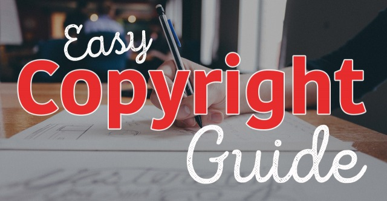

<h4>What Is A Copyright?</h4>
A copyright is the exclusive legal right to copy, publish, profit from, reproduce, or distribute a literary, musical, or artistic work. A copyright is typically given to the originator of a work or the entity it was created for. It essentially means that the holder of the copyright owns that work it as if it were their property. No one else may legally copy or profit from that piece of work, unless given permission by the owner of the copyright.
<h3>Copyright Issues</h3>
Copyright issues make up a large percentage of our rejected artwork rate. Many of you may not know this, but we have a few lovely people on our team who go through each and every artwork file that is ordered for print. They check up on a few things, copyright issues being one of the most important. We hate to see people going through the trouble to get artwork created and setup, only to have to reject it do to a copyright infringement. In an effort to prevent this from happening, we have come up with this super simple, no nonsense guide to understanding copyrighting laws.

These laws expand much further than just Print Aura's requirements. Be sure to read through them carefully and make sure you are not getting yourself into trouble elsewhere! There can be big time consequences if you are found to be breaking copyright laws. We don't report these issues, but we simply cannot print them without risking getting our members and ourselves into trouble.
<h4>Simple Copyright Guide</h4>
<h3>Ask Yourself</h3>
A very simple way to think about copyright laws is to ask yourself, "If I created this, would I be okay with someone else using it for their own profit?". If the answer is no, then you really shouldn't be including it in your design. Imagine you've spent a ton of time and energy creating a custom design to sell in your store. The artwork is yours and was made from your own creative perspective. Now imagine someone else just grabs the design you've been working on, and slaps it on a shirt and puts it up for sale in their own shop. Doesn't seem right, does it?
<h3>Not Allowed</h3>
<ul>
 	<li>Names, logos, pictures, or other intellectual property of musical groups or musical artists OR their lyrics.</li>
 	<li>Names, logos, pictures, or other intellectual property of sports teams, colleges/universities, clubs, or organizations.</li>
 	<li>Characters, images, actors, or likenesses from cartoon networks, comic books, video games, movies, and television shows.</li>
 	<li>Trademarks, names, or logos for companies other than your own.</li>
 	<li>Photos, caricatures, or other artwork depicting a celebrity. Even if you draw it yourself, you don't have the right to profit from someone's likeness.</li>
 	<li>Any image or graphic that is not listed as free for commercial use (i.e. images you find on Google images).</li>
 	<li>Phrases, quotes, or sayings from various forms of media including television, books, lyrics etc.</li>
 	<li>Internet meme or viral video inspired designs.</li>
</ul>
&nbsp;
<h3>Examples</h3>

<h3>Allowed</h3>
<ul>
 	<li>Any image or graphic that is royalty free for COMMERCIAL use.</li>
 	<li>Any image or graphic that is considered <a href="http://en.wikipedia.org/wiki/Public_domain">public domain</a>.</li>
 	<li>Any image or graphic that is 100% your design.</li>
 	<li>Any image or graphic that you commission and get the right to sell and reproduce from the artist.</li>
</ul>
&nbsp;
For a more in depth look, check out our <a href="https://printaura.com/legal-guide-tshirt-design" target="_blank">Complete Legal Guide</a>.
<h4>Questions?</h4>
Still wondering what's okay and what's not okay? If you still have questions regarding copyright laws, feel free to ask us below!

Save

Save