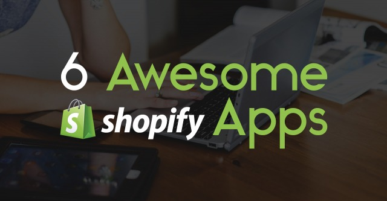

Shopify can be an amazing eCommerce platform for entrepreneurs to get their start, and continue on to big things! Out of all of our members, the majority of you use Shopify to host your online shops. Since so many of you are using this platform, we thought we'd ask you all a question .. 

<strong>Do you utilize the Shopify App Store? </strong>

If you are are member of PrintAura, you've probably at least taken a look. With thousands of apps available for the platform, it can be tough to figure out which apps are helpful, and which are downright superfluous. 

<h4>6 Awesome Shopify Apps You Need To Check Out</h4>
We've put together a small list of the Shopify Apps we feel are the most helpful in terms of marketing, communication, and more! 

<h3>1. Product Reviews </h3>
<strong>Price: Free</strong>
Establishing product and brand trustworthiness is important for converting new customers. Allowing your previous customers to leave you feedback shows not only that you are confident in your product, but that you are interested in what your customers have to say. What if people leave a negative review? Even negative reviews can be positive if you respond in a thoughtful and helpful way. This shows people you can admit a mistake, and are willing to make things right for your customers. We are all human, and people understand that!

Shopify's Product Review App allows your customers to leave you a rating and written feedback. The app also allows you control over publishing, as well as the option to respond to feedback, which is fantastic! You can also customize the design of your review section to match the theme of your shop. You can collect positive reviews to feature on other parts of your site too! 

<a href="https://apps.shopify.com/product-reviews" target="_blank">Check out Product Reviews </a>

<h3>2. Tidio Live Chat</h3>
<strong>Price: Free - $12/ Month</strong>
As your business grows, so will the amount of communication between you and your customers. Setting up a way to make communication smoooth and organized can be a huge benefit! With Tidio, you can set up a live chat feature within your store. I know I always greatly appreciate it when places I shop online offer the option to chat with someone in real time.  

Chats can be sent directly to your mobile devices, so you can stay ontop of every customer's communication. This app also allows you to view who is currently visiting your website, which can be a fun but also educational feature. If you aren't online, no biggie! The app allows you to set up an offline contact form if someone misses you. The app also boasts language features and automatic responses. 

<a href="https://apps.shopify.com/tidio-chat?utm_source=shopify-blog&utm_medium=blog&utm_campaign=10-high-impact-shopify-apps-that-can-help-you-sell-more" target="_blank">Check out Tidio</a>

<h3>3. Conversio</h3>
<strong>Price: Free (paid upgrade available)</strong>
This app allows you to send customized receipts to your customers after their purchases. This may seem simple and a little silly, but it can really get your customers excited about their purchases! You can also include incentives for the customer to return and make additional purchases. Receipts emails have a very high open-rate, so make use of it!

The app also offers some additional features with an upgraded paid version. 

<a href="https://www.shopify.com/blog/57215173-10-high-impact-shopify-apps-that-can-help-you-sell-more" target="_blank">Check out Conversio </a>

<h3>4. PrintAura</h3>
<strong>Price: Free</strong> 
Okay, shameless self plug time! But really, whether you are just starting out, or have been running an online shop for a long time, PrintAura is a great addition to your business. 

PrintAura allows you to sell your art or designs on multiple items, without having to face the risks of traditional eCommerce selling. You can create to your heart's content and never have to worry about keeping an inventory, or ending up with a pile of shirts that never sold. When you partner up with PrintAura, you are free to be as creative and daring as you want!

<strong>How does it work? </strong>

First you need to get setup on the PrintAura website. This includes uploading your designs, choosing and creating products, and using our integration to add the product to your store. You can add your art to hundreds of different items! There are no limits or minimums. When someone orders a product from your shop, we receive the order. We then print out or create whatever item is ordered, and ship it out to your customer for you. We print "on-demand", which means we only print what you sell, which in turn means, you only pay for items that you have already sold! 

<a href="https://printaura.com/register/" target="_blank">Check Out PrintAura</a>

<h3>5. Exit Offers </h3>
<strong>Price: $9.99/ Month</strong>
This is one cool idea! This app allows you to offer a customer a special deal if they are about to leave your store or abandon their cart. As a customer moves their mouse to exit before purchasing anything, an offer of your choosing will pop up. Small offers can make the difference between someone buying something, or leaving your shop. The app also allows you to create automated email campaigns, which can help in retaining and gaining business. 

<a href="https://apps.shopify.com/sticky-exit-offers?utm_source=shopify-blog&utm_medium=blog&utm_campaign=10-high-impact-shopify-apps-that-can-help-you-sell-more" target="_blank">Check out Exit Offers </a>

<h3>6. Plug-in SEO </h3>
<strong>Price: Free</strong>
Not sure about SEO? You are not alone, trust me! This app helps takes the guess work out of SEO. The app will search your site and alert you to problems that are worth your time to solve! It also makes solving those problems easier. Improving your SEO can help people find your shop more easily through search engines. The easier it is for the people to find you, the better. This one is definitely worth a look. 

<a href="https://apps.shopify.com/plug-in-seo" target="_blank">Check out Plug-in SEO</a>

<h4>Did We Miss Any Must-Haves?</h4>
Do you have a Shopify App you can't live without? We'd love to know what kinds of apps you guys are using, and how they are benefiting you business! 