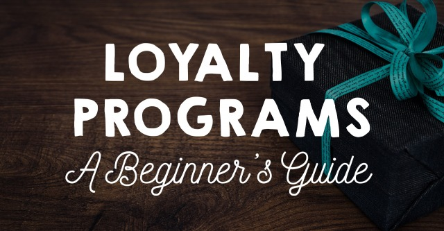

<h4>What Is A Loyalty Program?</h4>
A loyalty program is a rewards program that businesses offer to their loyal customers. Loyalty programs reward and encourage return purchasers. Every consumer loves to feel like their purchases are appreciated. A loyalty program is a great way to give back to your return customers and encourage more sales at the same time. It really is a win-win!
<h3>Benefits Of Loyalty Programs</h3>
Loyalty programs can demonstrate both a companies loyalty to their customers, and reward a customer's loyalty to a company. Here are some benefits that can ?? from loyalty programs:

<strong>1. Encourages return purchases</strong>
did you know that existing customers spend 67% more than first time customers? It makes sense that we focus on retaining our existing customers. What better way to do that then to reward them for shopping at your business?

<strong> 2. Allows for marketing opportunities</strong>
Once a customer signs up for your loyalty program, you have their name and email, and any other information you require for sign up. This allows you the opportunity to communicate with someone you may not have had the chance to otherwise.

<strong> 3. Encourages first time purchases</strong>
First time customers can also be persuaded to make an initial purchase if they feel that purchase will work towards something positive for them later on down the line. As consumers, we all love getting a good deal and feeling like our money goes as far as it can.

<strong> 4. Improves brand relationship</strong>
Having a loyalty program can help customers feel like they are part of your brand. It can improve opinions about a brand's identity and help to build a relationship between the company and the customer.
<h4>Simple Loyalty Program Types</h4>
Loyalty programs come in many different forms. Each will reward your customers for spending their hard earned money at your store. Here are some easy to implement programs that will encourage your customers to come back for more!

<strong>1. Points Program</strong>

A points program is a very simple and common type of loyalty program. They are generally easy to set up too. You just decide what actions allow your customers to earn points, and then offer benefits available to trade in for points earned. For example, let's say your customers receive 1 point for every dollar they spend. You can then offer different benefits for different amounts of points. Something like this:

$1.00 spent = 1 point
<ul>
 	<li>50 points = Free Shipping</li>
 	<li>100 points = 25% off next order</li>
 	<li>300 points = Free Item (or gift)</li>
 	<li>500 points = 2 Free Items</li>
 	<li>1,000 points = Personalized design item + free shipping &amp; 20% off future order</li>
</ul>
&nbsp;
Once the points are traded in for a benefit, they are gone.

<strong>2. Tiered Programs</strong>

Tiered programs are a variation on the points program. Instead of having people earn points to trade for different benefits, a customer receives benefits once they get to a certain level. For example, once you earn 100 points, you can unlock a certain benefit. The next tier could be 200 points, and would unlock a different benefit.

<strong>3. Punch Programs</strong>

Punch programs are similar to the programs you see in many coffee shops. Your customer gets an e-punch card, and with every purchase, or every certain amount of money they spend (ex: every $20 spent), they receive a punch in their card. When their card is full you can offer them a free item or a worthwhile benefit you see as appropriate.

<strong>4. VIP programs</strong>

VIP programs are a type of tiered program. Essentially after you spend a certain amount of money, you reach VIP status. This usually allows the customer access to free shipping and other special benefits.
<h3>Program Feature Ideas:</h3>
<ul>
 	<li>Exclusive Access To New Items</li>
 	<li>Future Purchase Discounts</li>
 	<li>Gifts With Purchase</li>
 	<li>Birthday Gifts</li>
 	<li>Free Shipping</li>
</ul>
&nbsp;
<h4>Loyalty Program Example</h4>
Let's take a quick look at <a href="http://tartecosmetics.com/tarte-tokens.php" target="_blank">Tarte Cosmetics</a>! Tarte's loyalty program is called "Pretty Perks". You can also create a fun name for your own loyalty program! Pretty Perks is a token based system where every dollar you spend is equal to one Tarte Token. There are also different ways to earn tokens that are not related to spending. The more you spend, the more tokens you earn. The more you interact with the brand, the more tokens you earn. Tarte could have gone a few different ways. They decided to settle on a tier system where as soon as you reach a certain amount of tokens you can unlock new benefits. This encourages customers to keep spending to receive deluxe samples and other gifts. Signing up for the loyalty program is free, and includes a special birthday offer.

 

Tarte is smart in that they reward their loyal customers for a few different things:
<ul>
 	<li>Purchases</li>
 	<li>Brand interaction</li>
 	<li>Referrals / Spreading the word</li>
</ul>
&nbsp;
Rewarding customers for more than just spending money can help improve and promote your business in ways that will help sales in the long run.
<h3>What About You?</h3>
Do you have a loyalty program in place for your customers? If so, let us know! How do you reward your customers for returning to your shop?