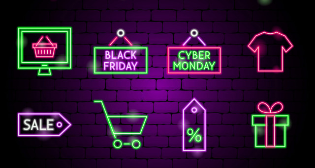

###E-Commerce and small businesses set to shine this holiday season as customers know they can count on them to come through! 

During a time when big retailers may be scrambling to find solutions to their shipping and manufacturing issues, small businesses will stay strong and attend to consumers’ needs.
Here at printaura.com we are well prepared to help you meet the demands of your customers or even help you finish off your own holiday shopping.  Nothing is better than giving a personalized gift you designed yourself!
No matter if you are a shopper or a shop owner, there are some things you should be considering right now:
Are you an online seller, do you operate an e-commerce store?
Many online retailers have already started offering sales or Black Friday pricing.  Have you started any sales campaigns to take advantage of the early shoppers that really want to make sure they can get what they want this year?  If not, there’s no better time than now!
###Since the ports are so backed up, have you considered items that are Made in America?  They are usually more available and at printaura.com we have a wide variety of items to choose from.  

If you haven’t looked at our products in a while, maybe now is a good time to check them out! www.printaura.com/shirts  
We are committed to making your store as successful as possible.  We are available to answer any questions, and have staff ready and waiting to get your packages out in time for holiday gift-giving.  While other retailers are having staffing issues that are creating delays, we are more than ready to handle the holiday rush!
* Don’t forget to stay connected with us on social media!

###Are you an online shopper?
We are also fulfilling individual shopping needs. Wouldn’t you love to give those on your list a personalized or customized gift this year?  Their smiles will be priceless when they unwrap such thoughtful gifts!  Here are some steps to help you give that special gift.
* Decide on who you need to shop for and create a list.
* Select the products you want to buy, check our social media posts for great gift ideas!
* Create a special design or use our design tool to help you out.  If you need help or have a question feel free to contact us.
* Place your order, and let us handle the rest.

###Happy Holidays!