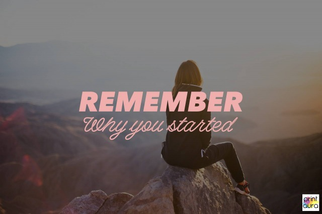

## Feeling Tired And Uninspired?

If you are feeling uninspired or unmotivated, you aren't alone! It can be tough to put work into a passion project or a second job, especially when you are already tired. Staying motivated can seem impossible, but it's not! A little reminder of why you started, and where you can get with hard work and dedication can make a huge difference!

## 25 Quotes To Live By For Entrepreneurs

Sometimes we all need a little extra push in the right direction. We've pulled some awesome motivational and inspirational quotes to kick start your week, and put some pep back in your step.
blah

### 1 "Nothing works until you do." - Maya Angelou
  

    

### 2. "Take the risk or lose the chance."

### 3. "Fiercely pursue your passion."

### 4. "Life can get tough. So can you."

 

### 5. "Difficult roads often lead to beautiful destinations."

### 6. "It always seems impossible until it's done."

### 7. "Be a voice, not an echo."

### 8. "Turn your passion into a paycheck."

### 9. "Don't wait for opportunity. Create it."

### 10. "Don't expect change if you don't make any."

### 11."Breathe in confidence. Exhale doubts."

### 12. "Do something today your future self will thank you for."

### 13. "Nourish in order to flourish."

### 14. "Remember why you started."

### 15. "Let your hope conquer your fear."

### 16. "You are your only limitation."

### 17. "Keep doing what makes your soul smile."

### 18. "Creativity is intelligence having fun."

### 19. "Get out of your own way"

### 20. "You are what you do, not what you say you'll do."

### 21. "Make time for yourself to be your best self."

### 22. "Art is what you can get away with." - Andy Warhol

### 23. "If it's still on your mind it's worth taking the risk."

### 24. "If you get tired, learn to rest, not to quit." -Banksy

<

### 25. "Do more of what makes you happy."

## Your Favorite Motivational Quotes
Do you have any quotes that are sure to inspire and motivate? Share them with your fellow entrepreneurs down below! Did one of the quotes on this post resonate with you? Let us know your favorite! We'd love to hear from you.
