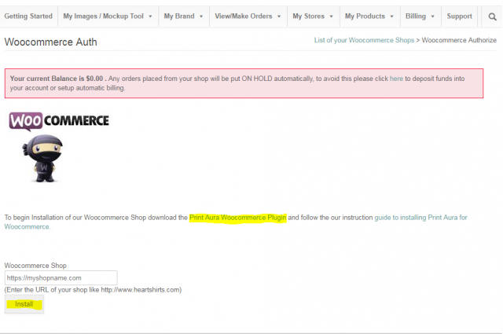
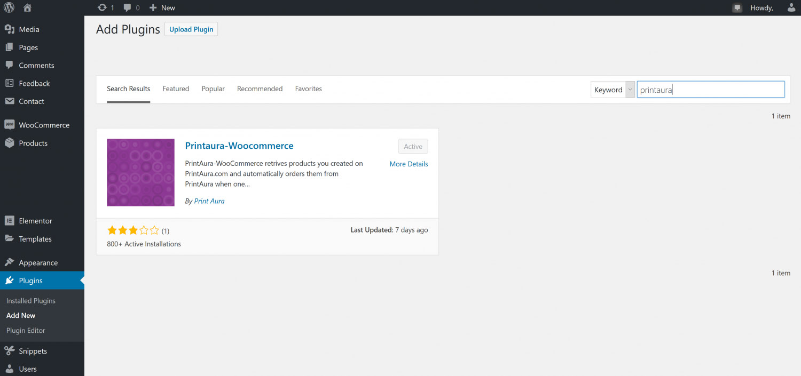
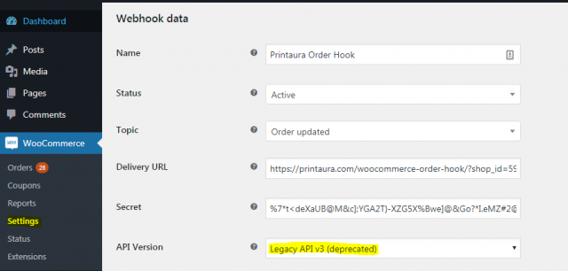
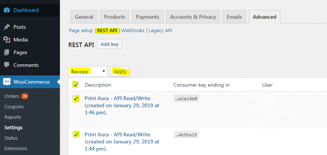

#### __**Having trouble setting up Woocomerce?**__ 

Please Take a look through this handy guide that details the installation steps and trouble shoots some common problems you may have. This article is for you is you have previously tried to setup a store but can't get orders to go through, orders were working but aren't now or if you went through the installation guide and are still having problems. 
 
===

---
>#### Step 1:
Logon to your PrintAura account and navigate to My Stores > Woocommerce Shops.
Click the link titled "click here" to begin.

---

---
>#### Step 2:
Under the field "Woocommerce Shop" enter the URL of your Woocommerce store it the text block, starting with "http://" or "https://". Do not click install yet.

---

---
>#### Step 3:
In a new tab go to your Woocommerce Store Admin panel and navigate to Plugins > Add New. In the search box type 'Printaura'. The Printaura-Woocomerce plugin will show up. Install and activate it.

---

---
>#### Step 4:
Return to the Woocommerce Store Installation tab.
Click Install to continue.**
You will be directed to your Woocommerce Shop. You will be asked to connect with PrintAura, simply click approve to let PrintAura setup your Woocommerce Store and begin setting up products.

---

---
#### __**Troubleshooting**__
___
Depending on the version of Woocommerce and word press you are using you may have to enable legacy webhooks complete the following actions if you are able to see orders in Woocommerce but are unable to view them in PrintAura*
___
>#### Navigate to Webhooks
Navigate to Woocommerce > Settings > Advanced > Webhooks

___

---
>#### Select each installed Webhook
In the Webhooks menu edit both PrintAura Webhooks one at a time.

---

___
>#### Select Legacy API v3
In the "Webhook data" menu select "Legacy API v3" and click save. Do this for both webhooks.

___

---
#### __**Re-Link**__ 

---

##### If you are still unable to view woocommerce orders on the printaura site the links between the site may be broken. to re-generate new links please follow the rest of the trouble shooting walkthrough to remove and re-install your Woocommerce shop on PrintAura.

---
> #### Delete Webhooks    
In the Woocommerce > Settings > Advanced "Webhooks" menu, described above, select all webhooks and Apply the "Delete permanently" action.

---

---
>#### Delete API Keys
Navigate to the "REST API" tab select all API Keys and apply the "Revoke" Action.

---

---
>#### Remove Shop on PrintAura My Shops
In your PrintAura My Shops > Woocommerce Shops select the remove action to uninstall the current shop.

---

---
>#### Clear Cookies and Cache
At this point clear your browser cookies and cache from the browser settings menu.

* [Chrome](https://support.google.com/accounts/answer/9098093?co=GENIE.Platform=Desktop&hl=en&visit_id=636843775705401342-2310875799&rd=1)
* [FireFox](https://support.mozilla.org/en-US/kb/clear-cookies-and-site-data-firefox)
* [Netscape](http://www.allaboutcookies.org/manage-cookies/netscape-6-plus.html)

___
>#### Relink Shop

**To Relink follow steps 1-5 and if necessary the steps outlined in trouble shooting to relink your store.** 

---
---