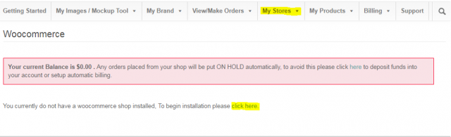
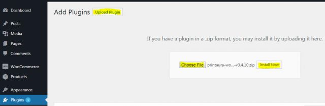
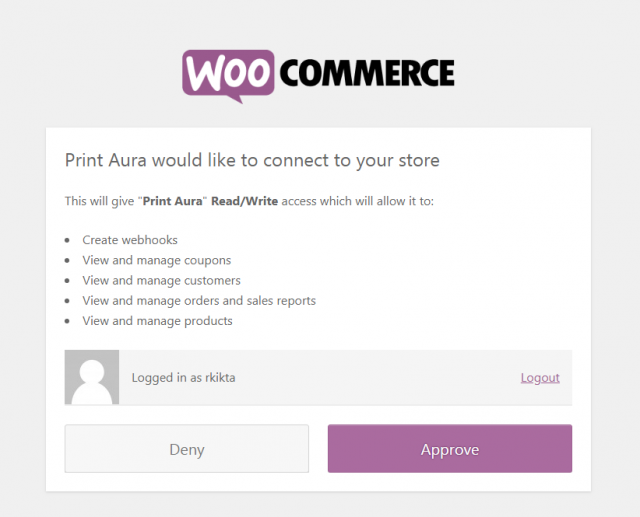
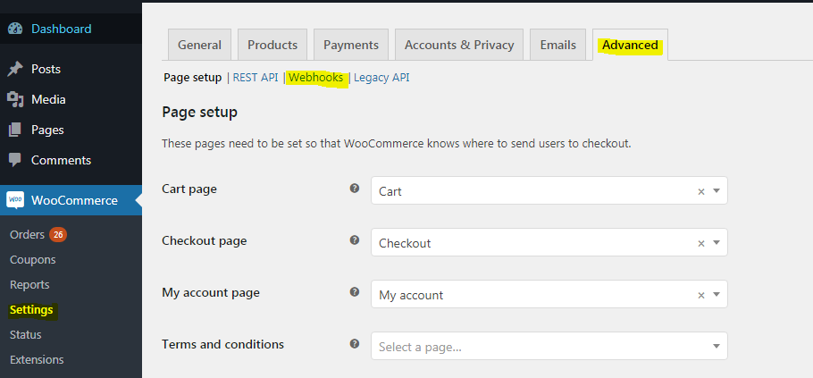
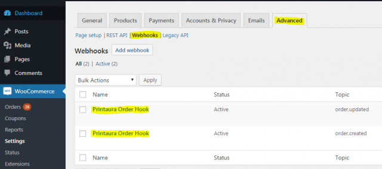
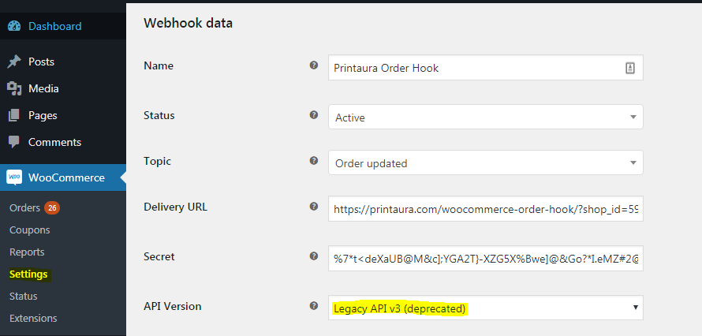
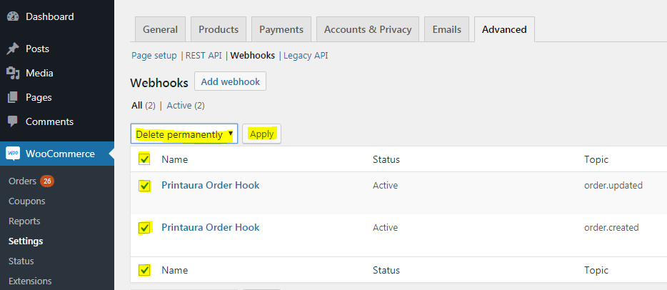
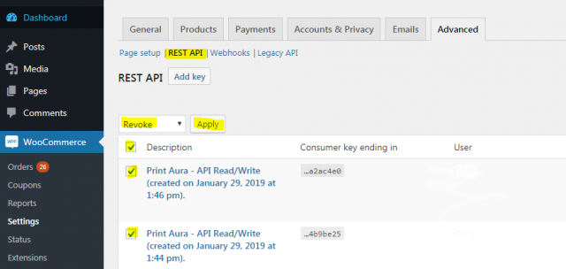

### Having trouble setting up Woocomerce? 

Please Take a look through this handy guide that details the instilation steps and trouble shoots some common problems you may have. This article is for you is you have previously tried to setup a store but can't get orders to go through, orders were working but aren't now or if you went through the installation guide and are still having problems. 
**Lookout for the updated printaura 4.0 plugin 'for open shopping carts' comming this spring.**  

===
#### Step 1:

&nbsp;

**Logon to your PrintAura account and navigate to My Stores > Woocommerce Shops.
Click the link titled "click here" to begin.**

&nbsp;

&nbsp;

#### Step 2:

&nbsp;

**First download the current PrintAura plugin from the "PrintAura Woocommerce Plugin" link and save it to a location ,such as My Desktop, for later.**

**Under the field "Woocommerce Shop" enter the URL of your Woocommerce store it the text block, starting with "http://" or "https://".**

&nbsp;

&nbsp;

#### Step 3:

&nbsp;

**In a new tab go to your Woocommerce Store Admin panel and navigate to Plugins > Upload Plugin then "Chose File" and select the .zip file you downloaded in the last step. Click "Install Now" to install the PrintAura-Woocommerce Plugin.** 

&nbsp;

&nbsp;

#### Step 4:

&nbsp;

**Return to the Woocommerce Store Installation tab.**

Click Install to continue.

**You will be directed to your Woocommerce Shop. You will be asked to connect with PrintAura, simply click approve to let Printaura setup your Woocommerce Store and begin setting up products.**

&nbsp;

&nbsp;
&nbsp;
&nbsp;

### Troubleshooting

&nbsp;

Depending on the version of Woocommerce and word press you are using you may have to enable legacy weebhooks complete the following actions if you are able to see orders in Woocommerce but are unable to view them in PrintAura*

&nbsp;

#### Navigate to Webhooks

&nbsp;

**Navigate to Woocommerce > Settings > Advanced > Webhooks**

&nbsp;

&nbsp;

#### Select each installed Webhook

&nbsp;

**In the Webbhooks menu edit both PrintAura Webhooks one at a time.**

&nbsp;

&nbsp;

#### Select Legacy API v3

&nbsp;

**In the "Webhook data" menu select "Legacy API v3" and click save. Do this for both webhooks.**

&nbsp;

&nbsp;
&nbsp;
&nbsp;

### Re-Link 

&nbsp;

#### Delete Webhooks

&nbsp;

**In the Woocommerce > Settings > Advanced "Webhooks" menu ,described above, select all webhooks and Apply the "Delete permanently" action.** 

&nbsp;

&nbsp;

#### Delete API Keys

&nbsp;

**Navigate to the "REST API" tab select all API Keys and apply the "Revoke" Action.**

&nbsp;

&nbsp;

#### Remove Shop on PrintAura My Shops

&nbsp;

**In your PrintAura My Shops > Woocommerce Shops select the remove action to uninstall the current shop.** 

&nbsp;

&nbsp;

#### Clear Cookies and Cache

**At this point clear your browser cookies and cache from the browser settings menu.**

&nbsp;
&nbsp;

#### Relink Shop

### To Relink follow steps 1-5 and if neccesary the steps outlined in trouble shooting to relink your store. 

&nbsp;
&nbsp;
