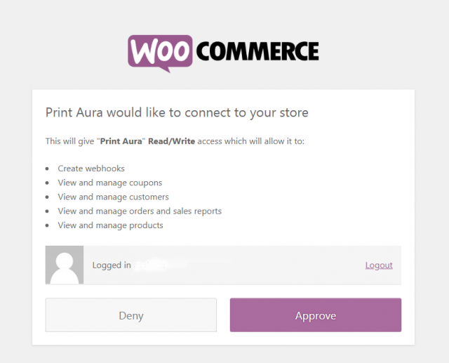
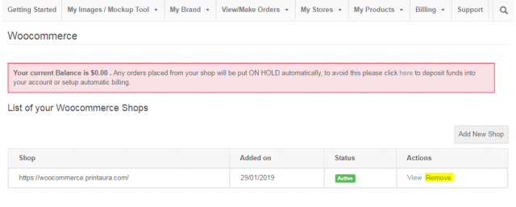

Having trouble setting up Woocomerce? Please Take a look through this handy guide that details the instilation steps and trouble shoots some common problems you may have. This article is for you is you have previously tried to setup a store but can't get orders to go through, orders were working but aren't now or if you went through the installation guide and are still having problems. 
Lookout for the updated printaura 4.0 plugin 'for open shopping carts' comming this spring.  

===

