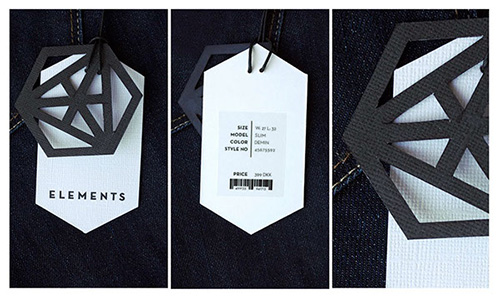
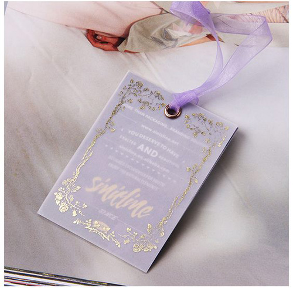

Let's talk about branding your products, ways to do it, and why it's important.  

===

## Branding Basics 

First of all, let's make sure we are all on the same page. We are working under the assumption that you've already begun to develop your brand. Hopefully you've read our article, "[Branding Basics: How To Start Building You Brand](https://blog.printaura.com/blog/tutorials/branding-basics-how-to-start-building-your-brand)". If you haven't, you might want to check it out! There we break down branding basics like how to develop your brand's identity and how to achieve consistency. Here, we will be diving a bit deeper into the branding options that are available to you as a Print Aura member. 

Let's say you've gone through all the trouble to develop your branding on a digital level. You've figured out your brand's identity, your logo is finally perfect, and your website and product pages are looking on point. Now, selling and sending out unbranded shirts can undo a lot of that work. We live in an age of easy distraction and poor retention. On a daily basis, people are exposed to up to 5,000 ads a day. Crazy, right? How many of those brands do you even recall seeing? How do you help ensure your brand leaves a lasting impression?

Let's say a first time customer finds your shop, buys a t-shirt, get's it in the mail, and tosses out the packaging and packing slip. What is there left on the product to signify where they purchased this garment from? A few months from now, do you think they will be able to recall? What if a friend, family member, or passerby admire the shirt and wants to know? 

## Branding Services 

There are plenty of online strategies you can employ to build relationships with your customers and increase return sales (we will cover this in a future article). However, on a purely real-world level, there's a lot you can to do to brand your items so people will remember where they got it from. 

### Hang Tags 

Hang tags are a great way to add some personality and brand visibility to your products. Though they will be thrown away before the customer's first use, it's a great way to make a good and lasting impression. For more hang tag examples, check out our article, "[12 Inspiring Hang Tag Designs](https://blog.printaura.com/blog/blog-posts/12-inspiring-hang-tag-designs)". Keep it simple, or go over the top! It's up to you.

**Elements**

Via [Bianca Christoffersen](https://www.behance.net/biancachristoffersen)

**BC Burnings**

Via [DesignbyDiamond](https://dribbble.com/DesignbyDiamond)

**Sinicline Designs**

Via [Sinicline](https://www.behance.net/sinicline) 

**Ferm Living**

Via [Ferm Living](http://blog.ferm-living.com/2010/01/new-hangtags-for-kids.html)

**Froget Me Knots**

Via [Natalie Palmer](https://www.behance.net/natalielouisepalmer)

### Neck Labels 

Neck labels are important because they are there on the garment to stay. Print Aura can remove existing garment branding, and add a neck label of your design. This way, when someone checks branding on the neck label, they will see your brand, and not Gildan or Next Level Apparel. Include a little, or include a lot (just make sure your follow these [re-labeling guidelines](https://printaura.com/guide-legal-requirements-t-shirt-relabeling). 

**Zeus Jones**

Via [Alex Register](https://dribbble.com/AlexRegister) 

**Nauti-Kids**

Via [Atlantic Ink](https://www.instagram.com/atlanticinkcrew/) 

**Dodge & Burn**

Via [Dodge & Burn](https://www.dodgeandburn.com/)

**Give A Fluff**

Via [Give A Fluff](https://giveafluff.com/)

**Neve & Hawk**

Via [Bob Galmarini](https://dribbble.com/bgalmar)

### Pack-ins

Pack-ins are a great way to spark a relationship with your customer to let them know that you care. Add an extra little goody to show your appreciation, a handwritten note, or a sale coupon off their next order. The possibilities are limitless! For even more on pack-ins, check out our article, "[How To Build Your Brand Using Pack-Ins](https://blog.printaura.com/blog/tutorials/how-to-build-your-brand-using-pack-ins)". 

**Pack-in Ideas:**

* Stickers 
* Small jewelry items 
* Handwritten note
* Brand pins 
* Buttons 
* Patches 
* Coupon Codes
* Etc...

## Brand Your Products!

Time to get to branding! Please don't hesitate to contact us if you have any questions about these branding options or how to get started. 

