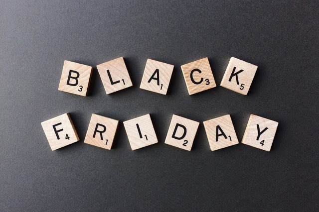

It's getting to be that time of the year again. A time for family, friends, celebration and joy! Not only that, but it's also the time of year when sales are a their highest. Are prepared to make the most out of this Holiday season? 

===

It's getting to be that time of the year again. A time for family, friends, celebration and joy! Not only that, but it's also the time of year when sales are a their highest. Are prepared to make the most out of this Holiday season? 

Black Friday / Cyber Monday Basics 

Shoppers get excited to make purchases during Black Friday and Cyber Monday for two main reasons:

1. This time of the year usually signals when the best possible deals arise
2. 

This is the time of year they have been waiting for! The question is, are you prepared? You could be missing out on sales if you choose not to particiapte. 

8 Easy Ways To Increase Sales Black Friday and Cyber Monday
If you are worried about -, there are still easy ways to participate in America's shopping holiday! You don't have to go BIG in order to see sales increase. Sometimes people just want to feel like they are getting added value for free, or saving money

1. Offer Free Shipping 
2. Offer Gifts With Purchase 
3. Offer % Off 
4. Offer Teired % Off
5. Offer Tiered Dollar Amounts Off
Like the tiered precentage off, this kind of incentive also encourages shoppers to spend more. The more they spend the more they save! Providing a dollar amount off can make the deal seem more tangible. For example, Spend $25 and get $5 off, Spend $40 and get $10 off, etc. These amounts can sound like more than simply saying "20% off" or "25% off".
6. Create Bundles / Gift Packs At Discounted Rates 
7. 

Extra Goodies
Here are a few images you can feel free to use to advertise your sales in both your shops and in newsletters. Just click on the image to be taken to its page where you can download it!

Black Friday

Cyber Monday

