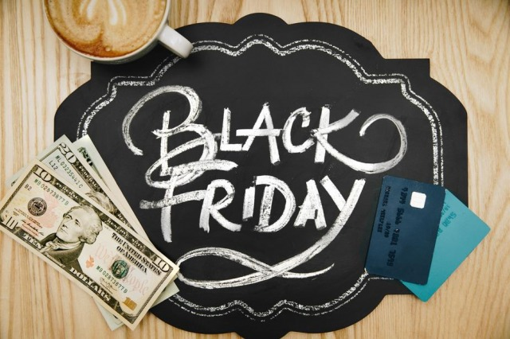
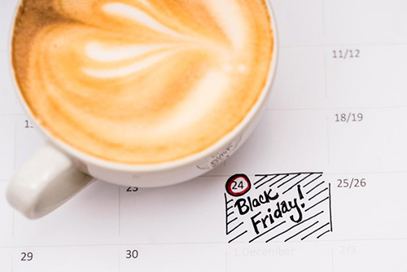
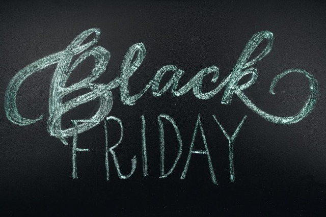
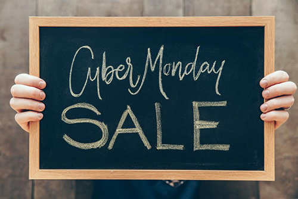

It's that time of the year again. A time for family, friends, celebration and joy! Not only that, but it's also the time of year when sales are at their highest. Are you prepared to make the most out of this Holiday season? 

**Click through for Black Friday / Cyber Monday Sale Ideas and Graphic Freebies!**

===

It's that time of the year again. A time for family, friends, celebration and joy! Not only that, but it's also the time of year when sales are at their highest. Are you prepared to make the most out of this Holiday season?

## Black Friday / Cyber Monday Basics

Shoppers get excited to make purchases during Black Friday and Cyber Monday for two main reasons:

1. To finally buy themselves something they have been waiting to buy on sale
2. To buy gifts for the holidays at a discounted rate

Bottom line, it all comes down to getting a great deal. This is the time of year shoppers have been waiting for! The question is, are you prepared? You could be missing out on sales if you choose not to participate.

## 8 Easy Ways To Increase Sales Black Friday and Cyber Monday

If you are worried about putting your products on mega sale, there are still easy ways to participate in America's shopping holiday! In fact, it may not make sense for you or your business to cut prices dramatically. You don't have to go BIG in order to see your sales increase. Many shoppers just want to feel like they are getting added value for free, or saving money on something they would have paid full price for.

Of course these marketing tips will work exponentially better if you effectively advertise them to your shoppers via newsletters, social media, on-site announcements, etc. If you don't advertise your sales, you are doing yourself a huge disservice!

### 1. Offer Free Shipping

Sometimes people hold off on buying lower end items due to shipping costs. Offering free shipping over black friday and cyber monday could be just the incentive a shopper needs to make a purchase!

### 2. Offer Gifts With Purchase

Offering gifts with purchase can be a fun and easy way to provide some extra value to normal purchases. You can send items to Print Aura to be added into your sales.

### 3. Offer % Off

This is a classic sales technique. If you don't usually hold sales, you can even advertise it as the best prices/ deals of the year! It doesn't need to be a high percent off. Many larger companies offer between 20% and 30% off on orders.

### 4. Offer Teired % Off

One way to ensure you are getting the best return on your deals and to encourage higher sales is to create a tiered deal system. This way, the more they spend the more they save! For instance you could do 10% off $25, 15% off $40, 20% off $100, and so on. This way, if someone has $30 worth of product in their cart, there is incetive to add more to get to a higher discount tier. 

### 5. Offer Tiered Dollar Amounts Off

Like the tiered precentage off, this kind of incentive also encourages shoppers to spend more. The more they spend the more they save! Providing a dollar amount off can make the deal seem more tangible. For example, Spend $25 and get $5 off, Spend $40 and get $10 off, etc. These amounts can sound like more than simply saying "20% off" or "25% off".

### 6. Create Bundles / Gift Packs At Discounted Rates

Creating product bundles is a perfect way to sell more over the holidays. Put themed items together into a bundle and offer it at a discounted price compared to buying the items all together. You can put together the bundles and advertise the bundles in many different ways. The bundles could be a one-and-done situation for an entire family, or for one person. 

### 7. Create A Gift Guide

Some shoppers don't have a good idea about what to buy that special person in their life. Help them out by making suggestions via a gift guide, featuring all your amazing products! Do you have something dad's love? Or a product that kid's go crazy over? Let your shoppers know!

### 8. Create Hourly Deals

Add even more urgency to purchasing by creating deals that expire. Discount an item for a limited time only, then move on to a different item.

## Extra Goodies

Here are a few images you can feel free to use to advertise your sales in both your shops and in newsletters. Just click on the link below the image to be taken to the page where you can download the full sized images!

### Black Friday

 
[Download Full Size](https://pixabay.com/en/black-friday-shopping-sale-retail-2925476/) 

 
[Download Full Size](https://burst.shopify.com/photos/black-friday-deals) 

 
[Download Full Size](https://burst.shopify.com/photos/black-friday-on-calendar) 

 
[Download Full Size](https://burst.shopify.com/photos/black-friday-in-chalk) 

 
[Download Full Size](https://pixabay.com/en/black-friday-christmas-1898114/) 

 
[Download Full Size](https://pixabay.com/en/black-friday-christmas-1878945/) 

### Cyber Monday

 
[Download Full Size](https://burst.shopify.com/photos/celebrate-cyber-monday-savings) 

 
[Download Full Size](https://burst.shopify.com/photos/cyber-monday-chalkboard) 

 
[Download Full Size](https://burst.shopify.com/photos/cyber-monday-sale-sign-by-computer) 

 
[Download Full Size](https://burst.shopify.com/photos/online-sale-cyber-monday) 

 
[Download Full Size](https://burst.shopify.com/photos/sale-signs)